# Integrating AWS CodeBuild with Bitbucket/GitHub #

This project will guide you through the process of integrating *AWS CodeBuild*
with *Bitbucket* or *GitHub* to build a simple python app that uses *poetry* for
package management. It will build this app into a docker container and deploy it
to *ECR* (Elastic Container Registry), following a versioning schema with *git tags*.

## Terraform ##

> Remember to change variables in the `variables.tf`, `buildspec.yml`, and module files.

* All resources will be created using Terraform, but I will guide you through
the process of creating them manually.

The terraform code in this project will create the following resources:

* An ECR repository
* A CodeBuild project
* A webhook to trigger the build process automatically
* A role for CodeBuild to assume
* A source credential for CodeBuild to use

> Remember to change variables in the `variables.tf`, `buildspec.yml`, and module files.

Upon running `terraform apply`, you will be prompted to enter the Bitbucket or GitHub repository URL.

### aws_codebuild_source_credential ###

To use either Bitbucket or GitHub as the source provider, you need to change the respective
block in the `modules/codebuild/main.tf` file:

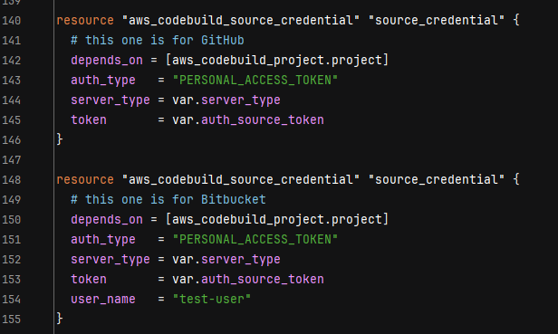
> Upper block for GitHub, lower block for Bitbucket.
> Comment the block you are not using.

### Personal access token ###

To authenticate with Bitbucket or GitHub, you need to create a personal access token.
> It's really important to follow the `principle of least privilege`, so make sure to
> give the token only the necessary permissions. You will need the `admin:repo_hook` permission.

## Python app ##

The python app is a simple function that returns the current date and time, using 
poetry for package management.

`packages/invoketime.py`:
```python
# this contains the packages that are used in the project

import time

def invoke_time():
    return time.ctime()
```

`main.py`:
```python
# this is the main file that will be executed, it imports the function from the packages
from packages.invoketime import invoke_time

if __name__ == "__main__":
    print(invoke_time());
```

# Setting up #

* Getting started

First, you need to create a new repository in Bitbucket or GitHub.

Next, you need to create a new project in AWS CodeBuild.
>Again, all resources will be created using Terraform, but I will guide you through
the process of creating them manually.

* CodeBuild project settings

In the CodeBuild project settings, you need to specify the source provider as
Bitbucket or GitHub. You will be prompted to connect your Bitbucket/GitHub account to AWS accordingly.

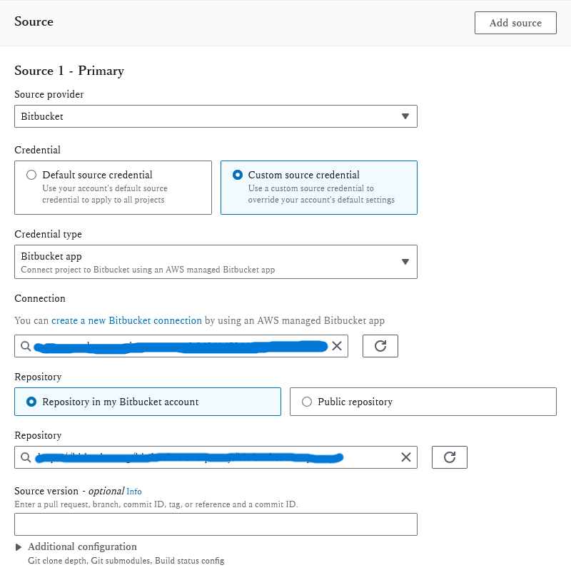
>Here, you can specify the project name, description, and environment settings,
> in this case, we are using bitbucket as the source provider.

You will need a new connection to Bitbucket. To do so click on the "Create a new Bitbucket connection" button,
a new window will open, and you will be prompted to log in to Bitbucket and authorize the connection.

The same process applies to GitHub, simply select GitHub as the source provider instead of Bitbucket.

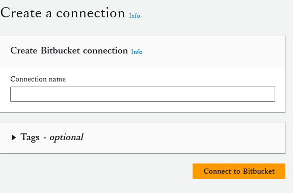

You will need to authorize the connection to AWS.

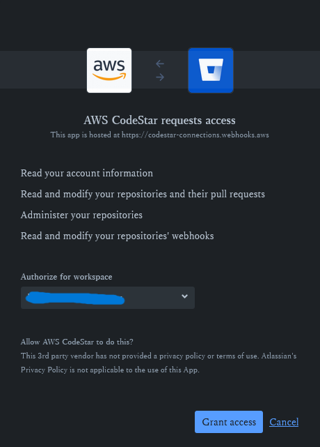

After you have connected your Bitbucket/GitHub account to AWS, you will be able to select the repository you want to build.

On buildspec, you can specify the buildspec file you want to use. The buildspec file is a yaml file that specifies the
build steps for your project. The default buildspec file is `buildspec.yml`.

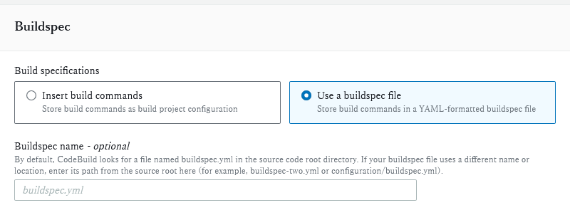

* Webhook configuration

To trigger the build process automatically, you need to configure a webhook on CodeBuild.

To it as follows:

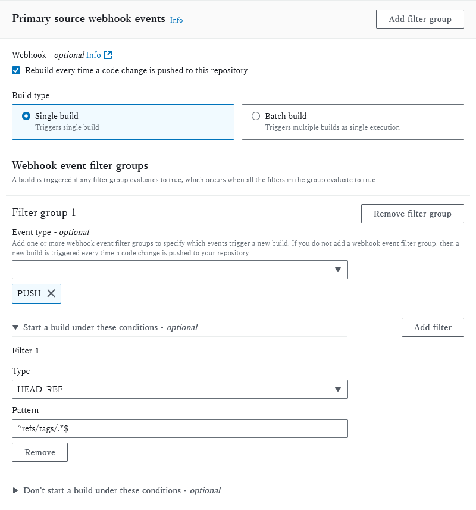
>Configurations for the webhook

Now, on push events, the build process will be triggered automatically. Note that
the pattern is `^refs/tags/.*`, which means that the build process will be triggered
only when a new tag is pushed to the repository, following a versioning schema.

## Buildspec ##

* The buildspec.yml file used in this project is as follows:

First we use:

    aws ecr get-login-password --region $AWS_DEFAULT_REGION | docker login --username AWS --password-stdin $AWS_ACCOUNT_ID.dkr.ecr.$AWS_DEFAULT_REGION.amazonaws.com

to log in.

>`aws ecr get-login-password` fetches a temporary password for `ECR`. 
This password is then piped into the docker login command, where 
`--password-stdin` tells Docker to expect the password from this input.

>`--username AWS`: Here, you're specifying the username for the Docker registry login. 
For Amazon ECR, the username is always AWS. 
This is because AWS uses the AWS credentials to authenticate, 
rather than a typical username. The AWS here doesn't refer to an actual 
username but indicates that AWS authentication should be used.

>`--password-stdin`: This option tells Docker to read the password from the standard input
(stdin) instead of prompting interactively. 
This is particularly useful in scripted environments like 
CI/CD pipelines where user interaction isn't possible or desirable.

Then, the docker build command is used to build the docker image.
The `-t` flag is used to tag the image with the repository URI. The `.` at the end of the command
specifies the build context, which is the current directory.

Finally, the `docker push` command is used to push the image to `ECR`.

The tag will be retrieved from git, and the image will be tagged with the git tag.

For example, if the git tag is `v1.0.0`, the image will be tagged as `v1.0.0`.

## Versioning schema ##

To trigger versioning schema, you need to run the following git commands

```bash
# first, add and commit your changes
git add .
git commit -m 'commit message'
```
    
```bash
# Create a new tag, The -a option makes it an annotated tag which includes the
# tagger's name, email, date, and tagging message.
git tag -a v1.0.0 -m 'version 1.0.0'
```

```bash
# then, push the tag to the remote repository
git push origin v1.0.0
```

After pushing the tag, the build process will be triggered automatically, note that it
was triggered by the webhook:

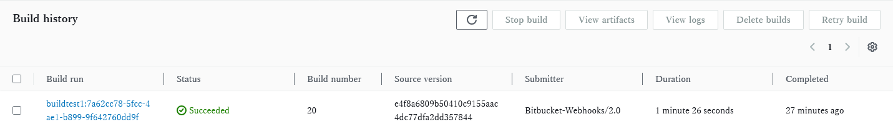

You can click on the build run to see the logs(you can also see the logs in cloudwatch logs):

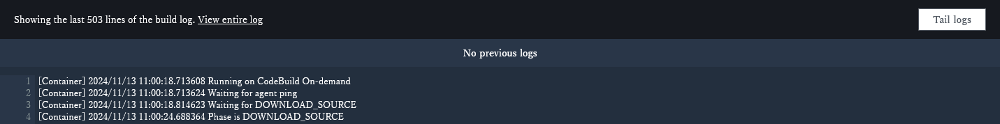

Then, you can check the ECR repository to see the image tagged accordingly:

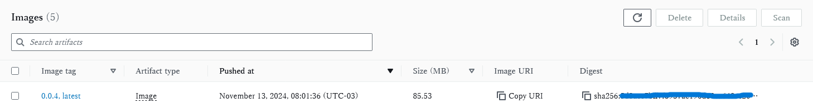

If you want, you can also check the request/response logs of the webhook. To do so:
* Head to the GitHub/bitbucket repository;
* Click on the repository settings;
* Click on the webhooks tab;
* Click on the webhook you want to check;
* Click on the recent deliveries tab.
* Click on the delivery you want to check.
* You can see the request/response logs:

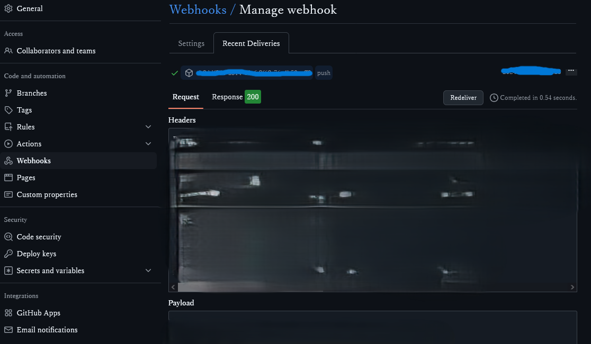

### Note about Bitbucket webhook logs: ###

If you are using Bitbucket, you will see that the webhook logs request history is disabled by default.
To enable it, you need to go to the repository settings, click on the webhook you want to check, and enable the request history:

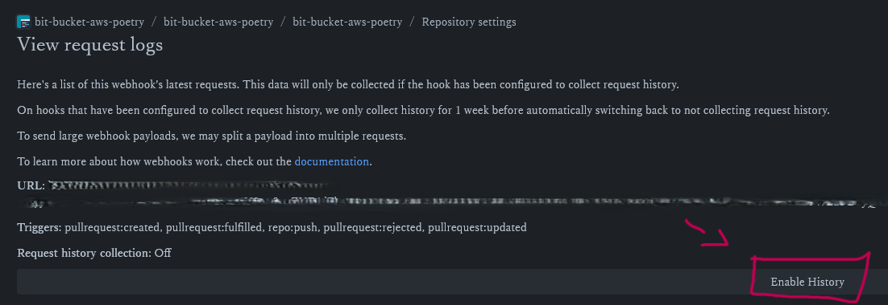

### Conclusion ###

This project showed you how to integrate AWS CodeBuild with Bitbucket/GitHub, automatically building 
and deploying a simple python app to ECR following a versioning schema with git tags.
